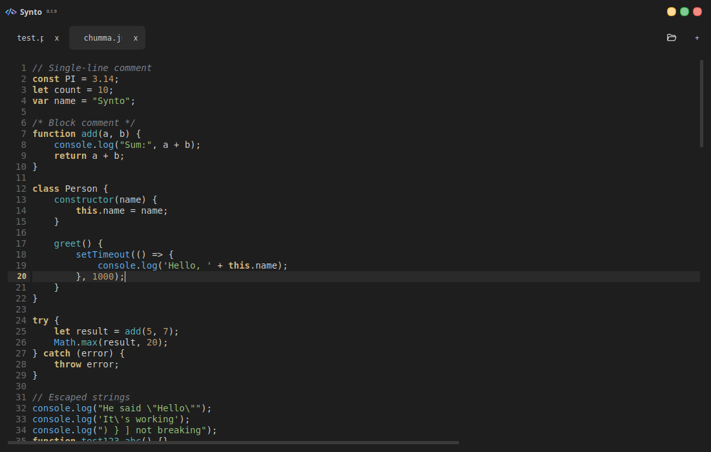
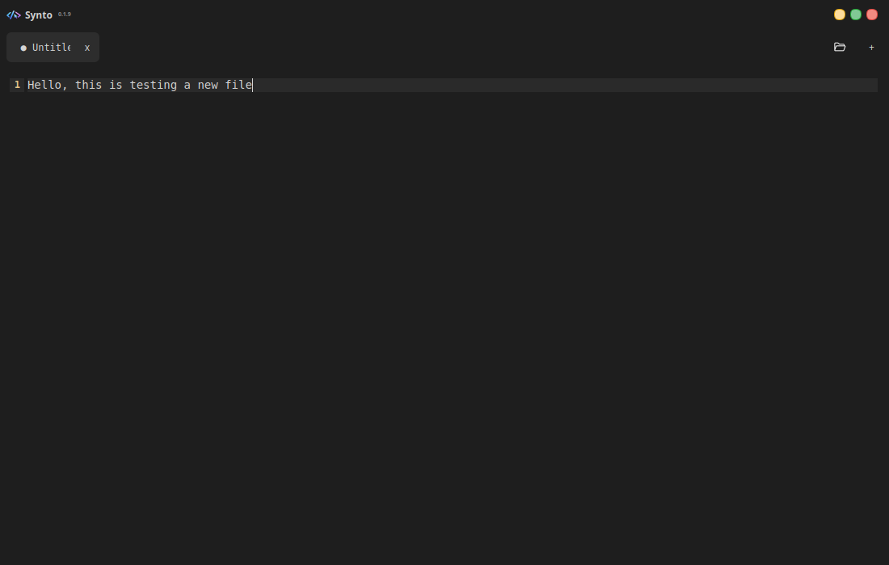
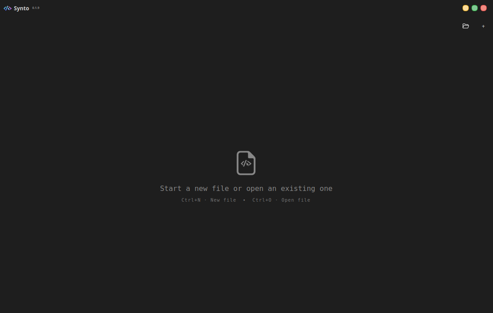

# Synto

A minimal, modern code editor for Linux.

Synto focuses on clarity, speed, and a distraction-free coding experience.  
This repository provides **Linux AppImage releases only**. The source code is not public.

No AI features yet — the current focus is on refining the core editor experience.

---

## Why Synto?

- Minimal, distraction-free interface
- Fast startup and smooth editing
- Smart indentation and bracket handling
- Keyboard-friendly workflow
- Built specifically for Linux (X11 & Wayland)

Synto is designed to stay out of your way while you code.

---

## Screenshots

> Screenshots shown are from the current Linux AppImage beta.





---

## Installation

### AppImage (Linux)

1. Download the latest `Synto.AppImage` from the **Releases** section.
2. Make it executable:
   ```bash
   chmod +x Synto.AppImage
   ```

3. Run it:

   ```bash
   ./Synto.AppImage
   ```

No installation required. No system files are modified.

---

## Feedback

This is an early Linux beta.

Please use GitHub Issues to report:

* Bugs or crashes
* UI/UX feedback
* Performance issues
* Wayland / X11 behavior

Feedback on editor feel and usability is especially appreciated.

---

## Roadmap

* Editor stability and performance improvements
* UI/UX refinements based on feedback
* Better session and tab handling
* Optional local AI assistance (later)

AI features will be added only after the core editor experience is solid.

---

## License & Usage

Synto is a proprietary, closed-source software product.

Only a Linux AppImage is provided. Source code is not included.

You may use the AppImage for personal or professional work.
Redistribution, modification, or reverse engineering is not permitted.

All rights reserved.

---
